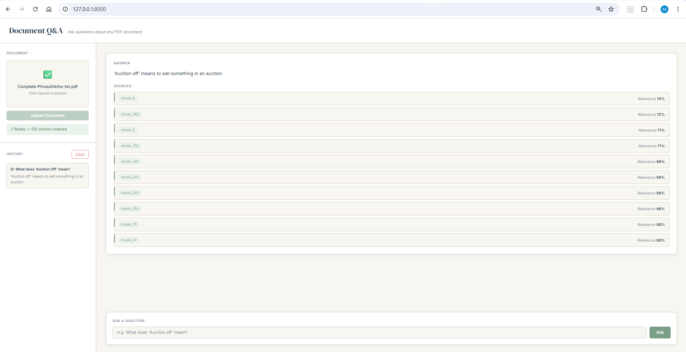

# Document Q&A System — RAG Pipeline

## What it does
This system provides a way to get answers to the questions asked by users about a given document. The document types supported currently are plain textual PDF files as the retrieval of text from these types of PDF files is simple compared to scanned PDFs.
Apart from getting the answers, users also get source citations showing which chunk the answer came from and a relevance score.
The system is accessible via a web interface — upload a PDF, ask questions, and view answers with source citations directly in the browser.

## Screenshots

**Initial view**


**With document uploaded and question answered**


## How it works
First a file is processed by the system to extract its text in chunks. The chunks are converted to vector embeddings using the OpenAI API and the `text-embedding-3-small` model. The vector embeddings are stored in ChromaDB collections. When a user asks a question, the related vector embeddings are fetched from the database using the vector embedding of the question. These related embeddings become the context for the model, to which the question is passed in order to generate the answer.

## Key technical decisions
The most interesting decision was switching from L2 to cosine similarity after diagnosing a silent retrieval failure. Cosine similarity uses the angle between two vectors, compared to L2 which measures similarity based on the distance between two points in space. For text embeddings, direction encodes meaning — not magnitude — making cosine the correct choice.

ChromaDB was chosen over pgvector for its simple installation and lightweight footprint. It supports both L2 and cosine similarity searches with no additional infrastructure.

HyDE (Hypothetical Document Embeddings) was tested but abandoned. HyDE generated hypotheticals using vocabulary not present in the document. HyDE works best for prose documents where hypothetical answers share vocabulary with the source. For structured reference lists with fixed vocabulary, direct question embedding performs better.

## Eval results
Evaluated against 15 manually verified questions across three categories: Exact, Semantic, and Not Found.

**Results:**
- Exact:     4/5  (80%)
- Semantic:  2/4  (50%)
- Not Found: 6/6  (100%)
- Overall:   12/15 (80%)

**What works well:**
- Exact phrase retrieval with direct question embedding
- Hallucination prevention — system correctly refuses to answer when context does not contain relevant information
- Cosine similarity with n_results=10 provides adequate coverage for most queries

**Known failure modes:**
- F001: Vocabulary overlap causes wrong chunk retrieval
- F002: Large chunks reduce retrieval precision for reference documents
- F003: Multiple valid answers exist for a single expected answer
- F004: Semantic retrieval fails for lexically distant queries
- F005: Silent path error — wrong vector store connected
- F006: HyDE failed for structured reference documents
- F007: Existence queries require hybrid search, not vector search

## What I'd build next
Expand the system to support scanned PDFs requiring OCR, as scanned PDFs are commonly used for information distribution. Also add hybrid search (BM25 + vector) for existence queries as documented in F007.

## Setup
Install Python 3.10+, then install dependencies:

```bash
pip install pdfplumber tiktoken httpx chromadb fastapi uvicorn python-multipart
```

Generate an OpenAI API key and save it as an environment variable. The API key is fetched from the environment instead of being hardcoded in the script:

```bash
set OPENAI_API_KEY=your_key_here  # Windows
```

```bash
# Run the web interface
cd web
uvicorn main:app --reload

# Then open http://127.0.0.1:8000 in your browser
```


